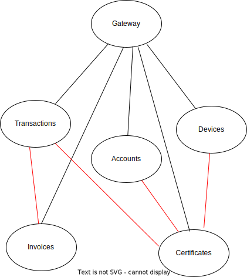

# Certigy POC

Certigy is a certificate register solution for Issuing Body - a party that is responsible for green certificates issuing.

Certigy is split to microservices according ot the picture.

!

Design of the system is described in [Design document](DESIGN.md)

